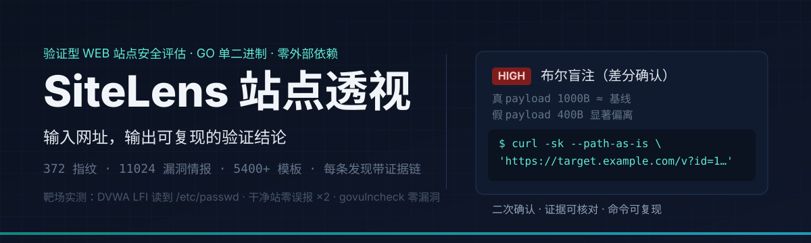

<div align="center">
  
</div>

<div align="center">

**输入一个网址，得到的是可复现的验证结论，而不是一堆猜测。**

[安装](#-五分钟上手) · [扫描模式](#-七种扫描模式) · [证据链](#-证据链长什么样) · [产品说明](docs/产品说明.md) · [开发文档](docs/开发文档.md)

</div>

---

## 它能证明什么（真实靶场实测）

SiteLens 不是只报"可能有问题"的扫描器——每条发现都做**二次确认重放**，并附带证据链。以下是它在标准靶场上的实际表现：

| 靶场 | 模式 | 实测结果 |
|---|---|---|
| DVWA（官方镜像，认证态） | full / apocalypse | **真实命中 LFI（读到 `/etc/passwd`）与 phpinfo** |
| pikachu / sqli-labs / upload-labs / xsslabs | full | 反射 XSS、SQL 注入、文件上传缺陷命中 |
| 干净站点（对照） | full × 2 轮 | **零误报** |
| 劫持探测 | takeover | 子域接管指纹命中，可自证 |

同一条扫描管线，在"该报的地方报得准、不该报的地方不吭声"，这就是它和玩具扫描器的区别。

## 五分钟上手

**方式一：图形安装（推荐）** —— 从 [Releases](../../releases) 下载 `SiteLens-1.0.0-setup-full.exe`，向导安装，完成即启动。

**方式二：便携包** —— 下载 `full-win64.zip` 解压，双击 `sitelens.exe`。

**方式三：源码**

```bash
go build -o sitelens.exe ./cmd/sitelens
./sitelens.exe serve             # Web 控制台，默认 http://127.0.0.1:5000
./sitelens.exe scan <url>        # 命令行全流水线扫描，JSON 输出
```

## 七种扫描模式

| 模式 | 一句话定位 |
|---|---|
| `quick` | 核心验证集，分钟级出结果 |
| `standard` | 爬虫 + 指纹 + 基础 DAST |
| `deep` | 扩展验证集 + 无头浏览器渲染 |
| `full` | 全流水线（模板子集 + 全模块），最常用 |
| `assets` | 资产测绘：子域 / 端口 / 服务面 |
| `stealth` | 隐匿姿态穿 WAF（限速 + 伪装） |
| `apocalypse` | 全模块 + 大模板量，**仅限授权目标** |

## 证据链长什么样

每条验证发现都带四件套：**重放请求、响应快照、通道命中信号、curl 一键复现**。
下面是一条真实形态的发现（JSON 导出）：

```json
{
  "check": "bool-blind-sqli",
  "title": "布尔盲注（SQL 差分确认）",
  "severity": "high",
  "url": "https://target.example.com/v?id=1",
  "evidence": "HTTP 200（二次确认）· 状态码命中 + 词命中",
  "signals": ["状态码命中", "词命中 'sql syntax'"],
  "request": "GET /v?id=1 AND 1=1 HTTP/1.1\r\nHost: target.example.com\r\n",
  "response": { "status": 200, "size": 1000, "snippet": "…query ok…" },
  "replay": "curl -sk --path-as-is 'https://target.example.com/v?id=1 AND 1=1'",
  "confirmed": true
}
```

粘贴 `replay` 命令即可亲手复核——**证据可核对，是验证器和普通扫描器的分界线**。

## 在引擎里工作的是什么

<details>
<summary><b>展开能力清单</b></summary>

- **指纹识别**：372 条精编规则（响应头 / Cookie / Meta / HTML / 脚本 / icon_hash favicon 哈希）+ 主动路径指纹
- **模板漏斗三前端**：nuclei path 形态、raw 请求形态（官方库大量模板 / 新版 afrog / TscanPlus）、afrog 经典 rules+expression——保守转换，不能诚实映射的整条拒收
- **DAST 主动探测**：反射 XSS、报错 SQLi、开放重定向、路径穿越、时间型 + 布尔差分盲注（双向差分、双确认）
- **SSRF 出带确认**：自托管 beacon（`/b/<128 位随机 token>`），目标回连即出带确认，不依赖外部服务，默认关闭
- **403 绕过探测**：路径变异 × 信任头 × 改写头 × HEAD/OPTIONS 变体表，命中即报"访问控制可被绕过"
- **漏洞情报关联**：11024 条情报 + CVSS v3.1 评分 + OSV 在线同步 + KEV 在野利用，三级判定（确认 / 可能 / 不受影响）
- **目录 / 子域 / 接管**：软 404 基线 + 回显剔除；子域 DNS 枚举 + 接管指纹
- **登录爆破审计**：字典爆破 + 验证码识别 sidecar，仅限授权目标
- **白盒源码审计**：TAINT 污点分析引擎 + 规则库，`sitelens audit <dir>`
- **批量与历史**：批量扫描、历史记录、双扫描 diff、漏洞检索、JSON/CSV/HTML/MD 四格式导出

</details>

## 工程质量

- **23 个包的单元测试** + CI 阻断级 `-race` 竞态门禁
- **govulncheck** 依赖漏洞扫描，当前零发现
- **百万次级 fuzz** 锤炼模板转换漏斗与 DSL 安全子集求值器
- **靶场回归门禁**：`tools/regression_nightly.sh`（农场→矩阵→零误报断言→拆场）

## 路线图

```
1.0 发现器 ✅ ─▶ 1.5 验证强化 🚧 ─▶ 2.0 验证器 ─▶ 3.0 利用器 ─▶ 4.0 审计器
  指纹+情报+DAST   证据链/盲注/出带   证据链全覆盖      利用级无害证明   AST 数据流
  七种模式         认证态复用         反序列化探测      影响面量化      CWE 全集
                                     回归 CI 化        利用链推导      黑白联动
```

## ⚠️ 合规

仅限对**自有或已获书面授权**的目标使用；全程只读无害验证，主动能力默认关闭且有硬上限。对未授权目标使用属违法行为。

---

<div align="center">
<sub>SiteLens 站点透视 · fengqiao · 单二进制 · 零外部依赖</sub>
</div>
