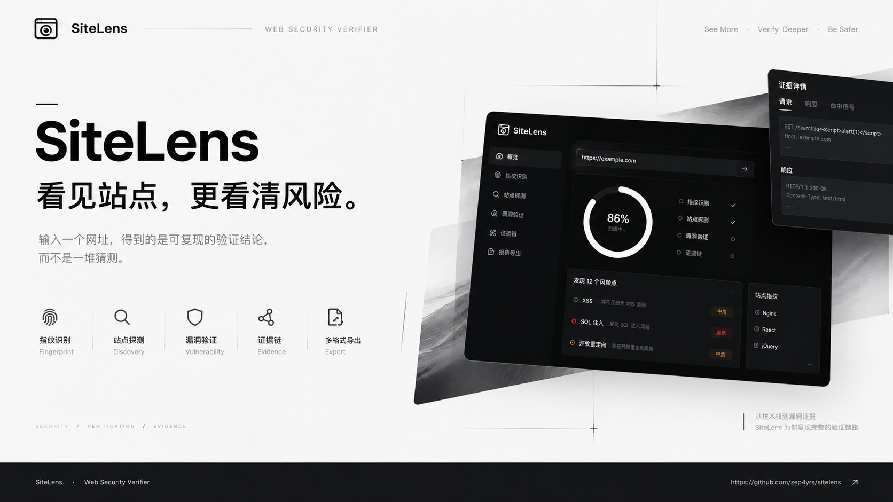
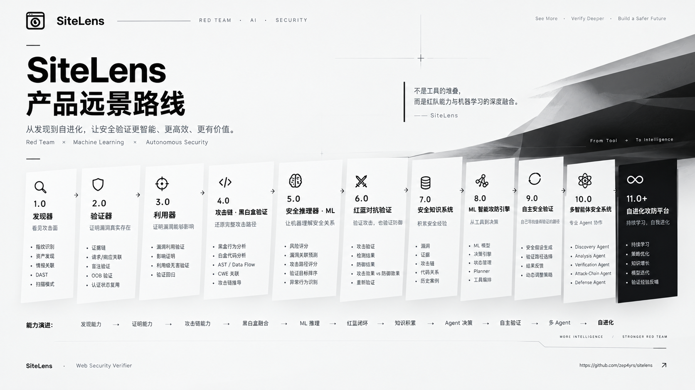
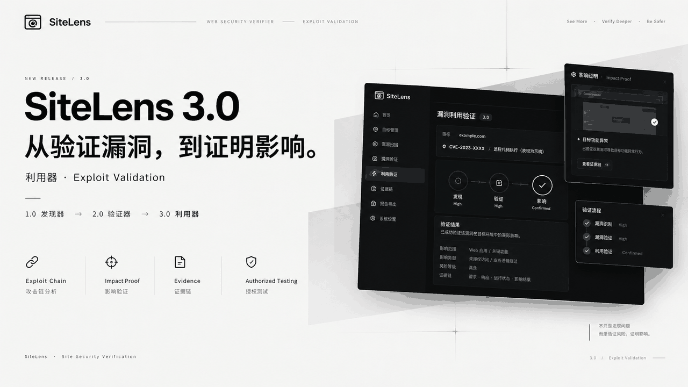
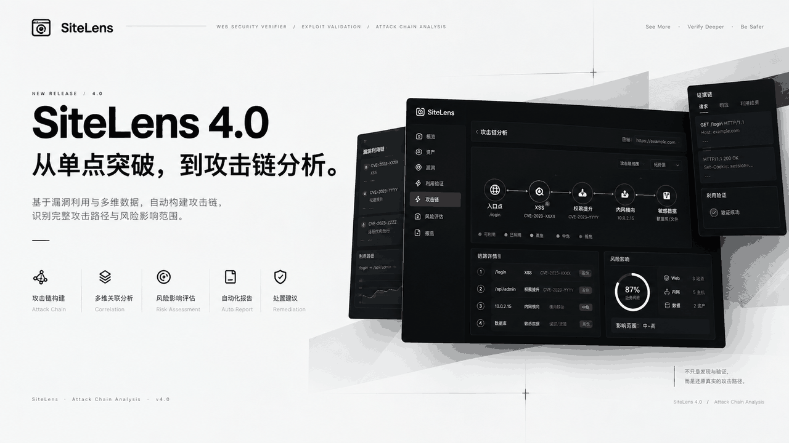

<div align="center">
  
</div>

<br>

<div align="center">
  
</div>

<div align="center">

**[产品架构](#产品架构) · [五分钟上手](#五分钟上手) · [配置](#配置) · [七种扫描模式](#七种扫描模式) · [证据链](#证据链长什么样) · [产品说明](docs/产品说明.md) · [开发文档](docs/开发文档.md)**

</div>

---

## 为什么是 SiteLens

成熟工具的组合（Nuclei + httpx + 子域工具 + 报告器）能产生大量警报，但它们的输出是各自为政的警报。SiteLens 只做一件事：**把每条警报变成可复核的验证结论**。

- 每条发现经**二次确认重放**，杜绝"一击即报"；
- 每条发现附带**证据链**：重放请求、响应快照、命中信号、curl 一键复现；
- 引擎 + 指纹 + 情报 + 报告装在**一个零依赖二进制**里，下载即用；
- **内置回归靶场门禁**：每次引擎改动都跑真实缺陷命中与零误报断言。

如果你需要的是更多的警报，成熟组合很好；如果你需要的是更少但可复核的结论——这就是 SiteLens 的位置。

---

## 产品架构

SiteLens 是**单二进制、零外部依赖**的验证器：CLI、Web 控制台、扫描引擎、数据资产与前端全部打进一个可执行文件，下载即跑。

### 分层结构

```
cmd/sitelens        进程入口：scan / serve / audit / update-* 子命令
internal/
  engine            扫描编排器：阶段调度、进度回调、取消、结果聚合
  target/httpx      目标校验（SSRF 防护）与 HTTP 采集
  crawler           同域爬取 + headless 渲染（chromedp）
  sitelens          指纹识别（响应头/Cookie/Meta/HTML/Script/icon_hash）
  intel             漏洞情报库：CVE/CVSS/KEV 三级判定
  checks/nuclei     验证型 check 与 Nuclei 模板漏斗
  modules           可选模块：目录/子域/接管/端口/WebShell
  dast              参数级主动探测（XSS/SQLi/重定向/穿越/盲注）
  audit             白盒污点分析
  security          安全响应头评分
  store             扫描历史持久化 + 异步作业管理
  server            HTTP 服务：REST API + 内嵌 SPA + 报告导出
data                指纹库 / 情报库 / 字典等数据资产
web                 内嵌前端（HTML/CSS/JS，零构建）
```

### 一次扫描的数据流

引擎 `engine.Scan` 是一条**顺序流水线**，每个阶段都可独立降级（数据缺失只跳过该能力，不阻塞整体）：

```
目标校验 → 认证登录 → 首页采集 → JS 攻击面提取 → 同域爬取
   → 指纹识别 → 安全头评分 → 专项 check → Nuclei 模板子集
   → 被动检测 → DAST 参数探测 → 子域/目录/端口/WebShell 枚举
   → TLS/DNS 检测 → 情报关联 → 安全评分
```

**关键设计**：指纹库（`sitelens.Matcher`）与情报库（`intel.KB`）支持运行期热替换，进行中的扫描持旧快照、新扫描取新数据，互不干扰；单次扫描全程用同一份数据快照，保证结果自洽。

### 三条交付形态

| 形态 | 入口 | 说明 |
|---|---|---|
| CLI | `sitelens scan <url>` | 全流水线扫描，stdout 出 JSON，可直接管道消费 |
| Web 控制台 | `sitelens serve` | 内嵌 SPA + REST API，默认 `http://127.0.0.1:5000` |
| 白盒审计 | `sitelens audit <dir>` | 源码污点分析，输出 JSON 报告 |

三者共用同一个 `internal/engine` 编排器与 `internal/store` 历史库——**同一套引擎，三种用法**。

模块划分与扩展方式见 [开发文档](docs/开发文档.md)。

## 它能证明什么（真实靶场实测）

SiteLens 不是只报"可能有问题"的扫描器——每条发现都做**二次确认重放**，并附带证据链。以下是它在标准靶场上的实际表现：

| 靶场 | 模式 | 实测结果 |
|---|---|---|
| DVWA（官方镜像，认证态） | full / apocalypse | **真实命中 LFI（读到 `/etc/passwd`）与 phpinfo** |
| pikachu / sqli-labs / upload-labs / xsslabs | full | 反射 XSS、SQL 注入、文件上传缺陷命中 |
| 干净站点（对照） | full × 2 轮 | **内置回归靶场零误报门禁通过** |
| 劫持探测 | takeover | 子域接管指纹命中，可自证 |

同一条扫描管线，在"该报的地方报得准、不该报的地方不吭声"，这就是它和玩具扫描器的区别。

## 五分钟上手

**方式一：图形安装（推荐）** —— 从 [Releases](../../releases) 下载 `SiteLens-2.0.0-setup-full.exe`，向导安装，完成即启动。

**方式二：便携包** —— 下载 `full-win64.zip` 解压，双击 `sitelens.exe`。

**方式三：源码**

```bash
go build -o sitelens.exe ./cmd/sitelens
./sitelens.exe serve             # Web 控制台，默认 http://127.0.0.1:5000
./sitelens.exe scan <url>        # 命令行全流水线扫描，JSON 输出
```

## 配置

配置文件从示例复制：把 [`.sitelens.example.yml`](.sitelens.example.yml) 复制为 `.sitelens.yml`，放在工作目录即可被自动加载；不改也能跑，默认零外部依赖。

- **完整键位语义见该示例文件内的注释**（`scan` / `checks` / `crawler` / `dast` / `auth` 等段）；
- **监听非 localhost 时必须配 API Token**：`serve --addr 0.0.0.0:5000` 需要一个 token 才允许启动，否则进程直接退出（见 `internal/server/server.go`）。这是硬校验，不是可选项；
- 主动验证能力默认关闭，只有显式开启才会发包（且带硬上限）。

## 七种扫描模式

| 模式 | 一句话定位 |
|---|---|
| `quick` | 核心验证集，分钟级出结果 |
| `standard` | 爬虫 + 指纹 + 基础 DAST |
| `deep` | 扩展验证集 + 无头浏览器渲染 |
| `full` | 全流水线（模板子集 + 全模块），最常用 |
| `assets` | 资产测绘：子域 / 端口 / 服务面 |
| `stealth` | 隐匿姿态穿 WAF（限速 + 伪装） |
| `apocalypse` | 全模块 + 大模板量，**仅限授权目标** |

## 证据链长什么样

每条验证发现都带四件套：**重放请求、响应快照、通道命中信号、curl 一键复现**。
下面是一条真实形态的发现（JSON 导出）：

```json
{
  "check": "bool-blind-sqli",
  "title": "布尔盲注（SQL 差分确认）",
  "severity": "high",
  "url": "https://target.example.com/v?id=1",
  "evidence": "HTTP 200（二次确认）· 状态码命中 + 词命中",
  "signals": ["状态码命中", "词命中 'sql syntax'"],
  "request": "GET /v?id=1 AND 1=1 HTTP/1.1\r\nHost: target.example.com\r\n",
  "response": { "status": 200, "size": 1000, "snippet": "…query ok…" },
  "replay": "curl -sk --path-as-is 'https://target.example.com/v?id=1 AND 1=1'",
  "confirmed": true
}
```

粘贴 `replay` 命令即可亲手复核——**证据可核对，是验证器和普通扫描器的分界线**。

## 在引擎里工作的是什么

<details>
<summary><b>展开能力清单</b></summary>

- **指纹识别**：372 条精编规则（响应头 / Cookie / Meta / HTML / 脚本 / icon_hash favicon 哈希）+ 主动路径指纹
- **模板漏斗三前端**：nuclei path 形态、raw 请求形态（官方库大量模板 / 新版 afrog / TscanPlus）、afrog 经典 rules+expression——保守转换，不能诚实映射的整条拒收
- **DAST 主动探测**：反射 XSS、报错 SQLi、开放重定向、路径穿越、时间型 + 布尔差分盲注（双向差分、双确认）
- **SSRF 出带确认**：自托管 beacon（`/b/<128 位随机 token>`），目标回连即出带确认，不依赖外部服务，默认关闭
- **403 绕过探测**：路径变异 × 信任头 × 改写头 × HEAD/OPTIONS 变体表，命中即报"访问控制可被绕过"
- **漏洞情报关联**：11024 条情报 + CVSS v3.1 评分 + OSV 在线同步 + KEV 在野利用，三级判定（确认 / 可能 / 不受影响）
- **目录 / 子域 / 接管**：软 404 基线 + 回显剔除；子域 DNS 枚举 + 接管指纹
- **登录爆破审计**：字典爆破 + 验证码识别 sidecar，仅限授权目标
- **白盒源码审计**：TAINT 污点分析引擎 + 规则库，`sitelens audit <dir>`
- **批量与历史**：批量扫描、历史记录、双扫描 diff、漏洞检索、JSON/CSV/HTML/MD 四格式导出

</details>

## 工程质量

- **18 个包的单元测试**（52 个测试文件）+ CI 阻断级 `-race` 竞态门禁
- **govulncheck** 依赖漏洞扫描，当前零发现
- **百万次级 fuzz** 锤炼模板转换漏斗与 DSL 安全子集求值器
- **靶场回归门禁**：`tools/regression_nightly.sh`（农场→矩阵→**内置回归靶场零误报断言**→拆场；这是固定靶场的门禁口径，不代表真实互联网环境的误报率承诺）

## 路线图 —— 产品远景

<div align="center">
  
</div>

**不是工具的堆叠，而是红队能力与机器学习的深度融合。** 从发现到自进化，让安全验证更智能、更高效、更有价值。

| 版本 | 定位 | 核心问题 | 关键能力 |
|---|---|---|---|
| **1.0 发现器**（已发布） | DISCOVERY | 看见攻击面 | 指纹识别 · 资产发现 · 情报关联 · DAST · 扫描模式 |
| **2.0 验证器** ✅ 当前版本 | VERIFICATION | 证明漏洞真实存在 | 证据链（请求/响应/命中）· 盲注/出带验证 · 认证态复用 · 可复现报告 |
| **3.0 利用器** | EXPLOIT VALIDATION | 证明漏洞能够影响 | 漏洞利用验证 · 影响证明 · 利用级无害验证 · 验证回归 |
| **4.0 攻击链·黑白盒验证** | ATTACK CHAIN | 还原完整攻击路径 | 黑盒行为分析 · 白盒代码分析 · AST/Data Flow · CWE 关联 · 攻击链推导 |
| **5.0 安全推理器·ML** | ML REASONING | 让机器理解安全关系 | 风险评分 · 漏洞关联预测 · 攻击路径评分 · 验证目标排序 · 异常行为识别 |
| **6.0 红蓝对抗验证** | RED-BLUE VALIDATION | 验证攻击，也验证防御 | 攻击验证 · 检测结果 · 防御结果 · 攻防效果对比 · 重新验证 |
| **7.0 安全知识系统** | SECURITY INTELLIGENCE | 积累安全经验 | 漏洞 · 证据 · 攻击链 · 代码关系 · 历史案例 |
| **8.0 ML 智能攻防引擎** | 从工具到决策 | 下一步做什么？ | ML 模型 · 决策引擎 · 状态管理 · Planner · 工具编排 |
| **9.0 自主安全验证** | AUTONOMOUS VERIFICATION | 自主寻找并验证薄弱点 | 安全假设生成 · 验证路径选择 · 结果反馈 · 动态调整策略 |
| **10.0 多智能体安全系统** | MULTI-AGENT | 专业 Agent 协作 | Discovery / Analysis / Verification / Attack-Chain / Defense Agent |
| **11.0+ 自进化攻防平台** | SELF-EVOLVING | 持续学习，自我进化 | 持续学习 · 策略优化 · 知识增长 · 模型迭代 · 验证经验反哺 |

**能力演进**：发现能力 → 证明能力 → 攻击链能力 → 黑白盒融合 → ML 推理 → 红蓝闭环 → 知识积累 → Agent 决策 → 自主验证 → 多 Agent → 自进化

**已定型的版本宣发图**（3.0 利用器 / 4.0 攻击链）：

<div align="center">
  
</div>

<div align="center">
  
</div>

## 合规

仅限对**自有或已获书面授权**的目标使用；全程只读无害验证，主动能力默认关闭且有硬上限。对未授权目标使用属违法行为。

## 开源协议

本项目基于 **[GPL-3.0](LICENSE)** 协议开源：任何基于本项目的二次开发与再发布，必须同样以 GPL-3.0 开源并保留原始版权声明。

---

<div align="center">
<sub>SiteLens 站点透视 · fengqiao · 单二进制 · 零外部依赖</sub>
</div>
